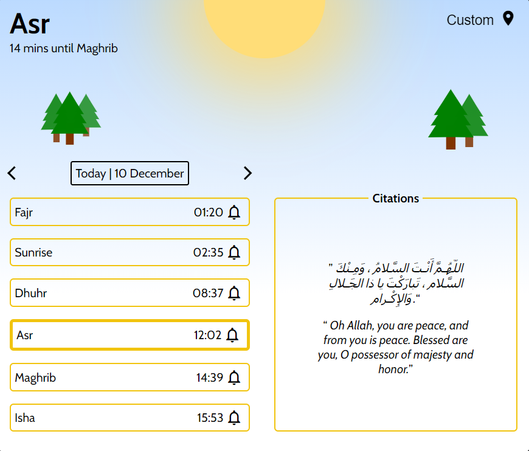
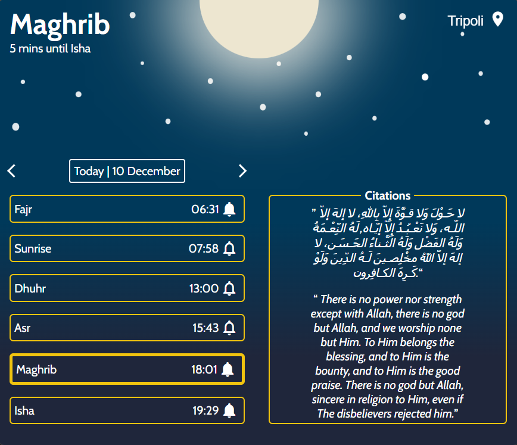

# Mihrab

islamic Prayer reminder application for desktop(windows/linux).

### Application theme automatically alternates between two themes based on system time settings.

Sunrise --> Maghrib           |  Maghrib --> Sunrise
:-------------------------:|:-------------------------:
  |  

- Accurate prayer times for any day based on the user's location.
- basic operating system notifications with default sound settings.
- Randomally generated citations that change every 30 minutes.
- Receive notifications for select prayers.
- Prayer times are calculated using the **University of Islamic Sciences** calculation method.

no macOS version.
