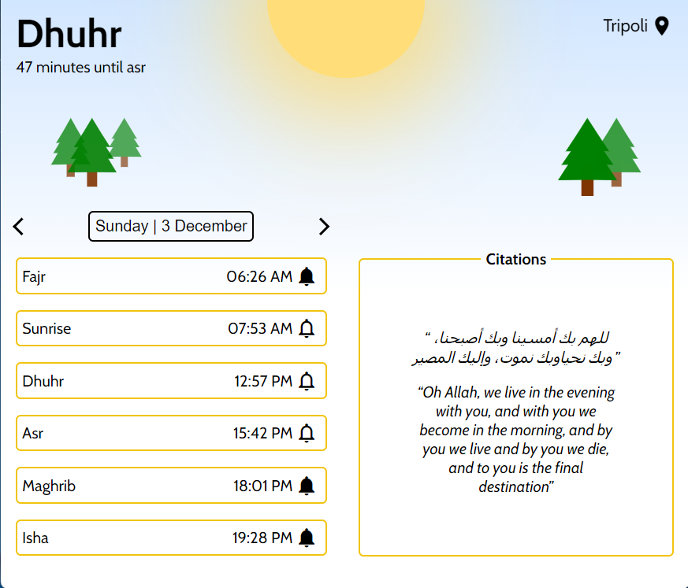
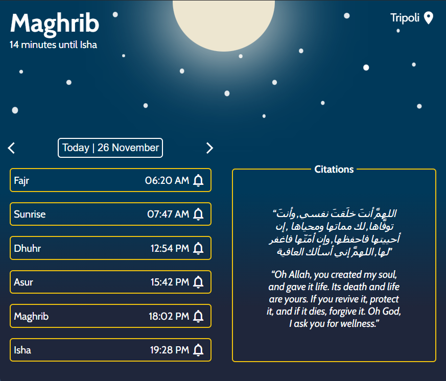

# Pray Alert

Cross platform islamic Prayer reminder application, made with electron.

### Application theme automatically alternates between two themes based on system time settings.

Sunrise --> Maghrib           |  Maghrib --> Sunrise
:-------------------------:|:-------------------------:
  |  

- Accurate prayer times for any day of the year based on the user's location.
- basic OS notifications with system sound settings.
- Randomally generated citations that change every 4 hours.
- Select which prayer you'd like to recieve notifications for.
- Prayer times are calculated using the **University of Islamic Sciences, Karachi** calculation method.

Will soon be available on the microsoft store/etc.